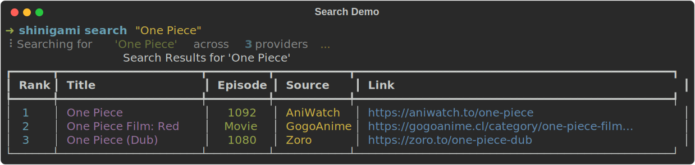
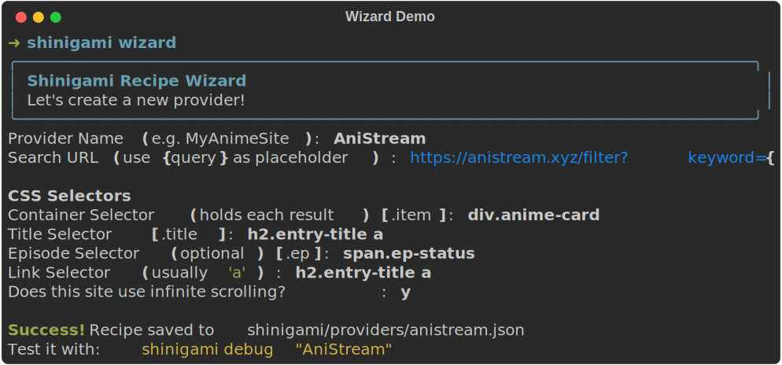

# Shinigami

**Shinigami** is a CLI-based Content Discovery Engine that aggregates anime metadata from multiple websites. It uses **Playwright** for high-performance async scraping and **Typer** + **Rich** for a beautiful terminal interface.

## Features

- **Multi-Provider Support**: Easily modifiable JSON recipes to add new sources.
- **Async Concurrency**: Scrape 5+ sites simultaneously.
- **Human Emulation**: Rotates User-Agents and adds random delays to avoid detection.
- **Rich UI**: Tables, status spinners, and colored output.


## How It Works

Shinigami acts as a metasearch engine for anime:
1. **Aggregates** query results from multiple providers (defined in JSON).
2. **Emulates** a real user browser using `playwright` to bypass bot protections.
3. **Parses** the HTML using CSS selectors to extract titles, episodes, and links.
4. **Displays** the data in a sorted, interactive terminal table.

## Installation

1. **Clone the repository**
   ```bash
   git clone https://github.com/yourusername/shinigami.git
   cd shinigami
   ```

2. **Install Dependencies**
   ```bash
   pip install -r requirements.txt
   ```

3. **Install Browsers**
   ```bash
   playwright install
   ```

## Usage

### 1. List Available Providers
See which websites Shinigami is currently configured to scrape.

```bash
python -m shinigami.cli.main list-providers
```

### 2. Search for Anime
Search across all providers simultaneously. The results are sorted and displayed in a unified table.

```bash
python -m shinigami.cli.main search "One Piece"
```

### 3. Debug a Provider
If a provider isn't working, debug it individually to see the raw data it returns.

```bash
python -m shinigami.cli.main debug "LiveChart" --query "Naruto"
```

### 4. Create Your Own Provider (Wizard)
Shinigami includes an **interactive wizard** that guides you through creating a new provider recipe.
Instead of manually editing JSON files, the wizard prompts you for:
- **Site Name**: The name of the provider.
- **Search URL**: The URL used to search on the site (with `{query}` placeholder).
- **CSS Selectors**: The specific CSS classes for the container, title, episode, and link.



```bash
python -m shinigami.cli.main wizard
```

## Included Providers

Shinigami comes with a "Starter Pack" of providers (thanks to YarrList):
- **LiveChart** (Metadata)
- **MyAnimeList** (Metadata)
- **HiAnime** (Streaming)
- **GogoAnime** (Streaming)

## Adding Providers Manually

Create a new JSON file in `shinigami/providers/`. Example:

```json
{
  "name": "MyAnimeSite",
  "search_url": "https://site.com/search?q={query}",
  "selectors": {
    "container": ".item",
    "title": ".title",
    "episode": ".ep-num",
    "link": "a"
  }
}
```

## ⚠️ Troubleshooting

### Links leading to wrong pages?
If you select a result and it takes you to a different anime, or if the data looks "jumbled", the **CSS Selectors** in your provider recipe are likely incorrect.
- **Title Selector**: Must capture *only* the title text.
- **Link Selector**: Must be the `<a>` tag pointing to the specific anime page.
- **Container**: Must wrap *exactly* one search result item.

To fix this, use the `debug` command to check what the scraper is seeing:
```bash
python -m shinigami.cli.main debug "ProviderName" --query "One Piece"
```

### No results found?
- Check if the site is reachable from your browser.
- Ensure the `search_url` correctly includes the `{query}` placeholder.
- Verify that your `container` selector matches the visual elements on the site.

## License

This project is licensed under the **GNU Affero General Public License v3.0 (AGPL-3.0)** - see the [LICENSE](LICENSE) file for details.

### Dual Licensing
**Shinigami** is available under a dual license:
- **AGPLv3** for open-source projects and personal use.
- **propietary/Commercial License** for businesses using it in closed-source applications.

Contact us for commercial licensing inquiries.

## 📊 Open Dataset
We maintain a curated dataset of popular anime metadata in `data/anime_dataset.csv`.
You can hydrate or update this dataset using our script:
```bash
python scripts/hydrate_dataset.py
```
